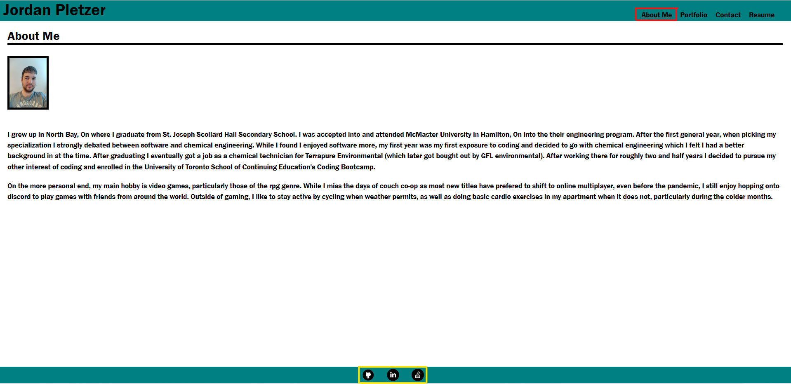
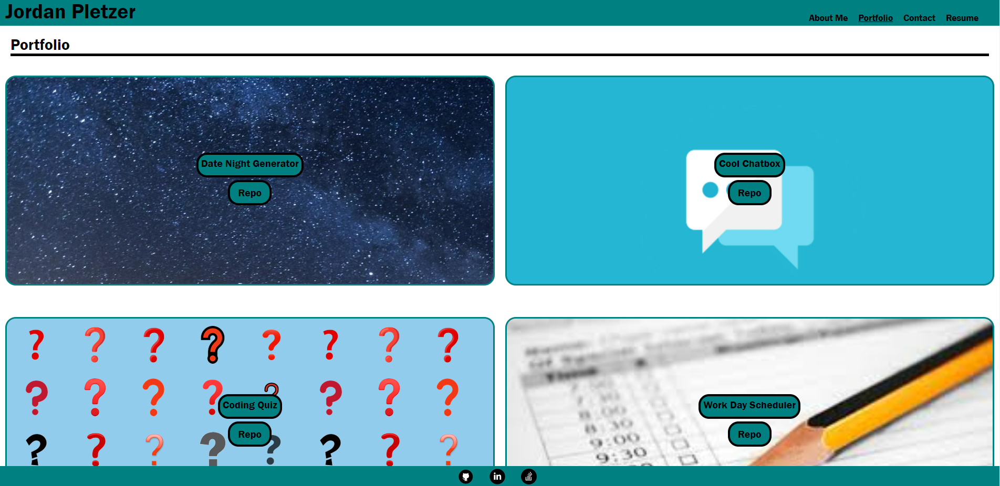
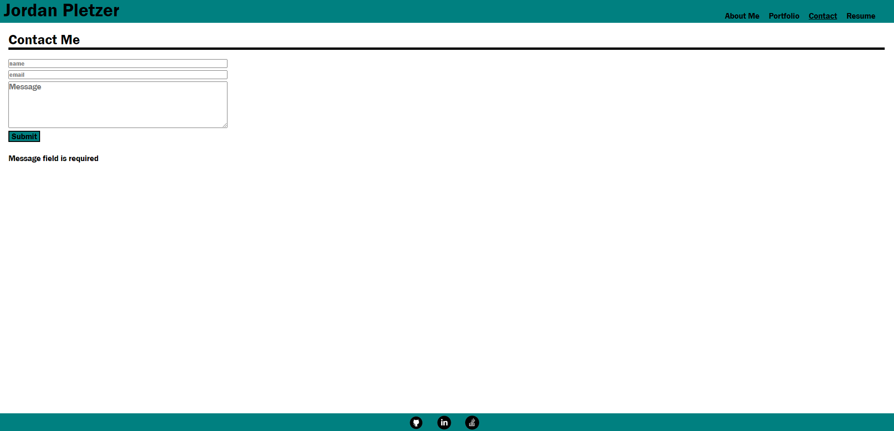
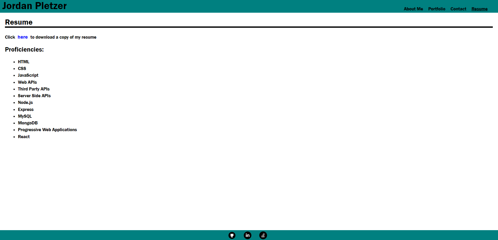

# React-Portfolio
## Description

The goal of this assignment was to create a professional portfolio using react

## Live Deployment link

The live deployment of the site can be found at: https://pletzjd.github.io/React-Portfolio/

## Usage

The portfolio has four main tab, with the current tab highlited with an underline as show below in red

At the bottom of the page, highlighted in yellow in the above image, are icons for github, linkedIn and stack overflow which when clicked link to my personal profile for each of those respective sites.

The above image shows the "About Me" section of the the website. In this section there is a profile picture of myself along with brief description about myself.

Below is the section for the portfolio of my work. There are a total of six projects displayed on this page. Each image links to the deployed application. The button labeled 'Repo' links to the repo of the application.

Below is the section to contact me. It contains a form that can be filled out to send me a message (not functional at the moment). If a field is left blanc when focus is lost or the email address inputed does not look like a valid email address an error message displays below the form to alert the user. When the submit button is clicked and all the fields are properly filled in an alert message pops up to inform the user that a message has been sent.

The final section shown below is the resume section. A copy of my resume can be downloaded by clicking the blue "here". A list of my coding proficiencies can also be found displayed here.

## Credits

Site developper(s):
- Jordan Pletzer: https://github.com/pletzjd

## License

MIT License

Copyright (c) [2022] [Jordan Daniel Joseph Pletzer]

Permission is hereby granted, free of charge, to any person obtaining a copy
of this software and associated documentation files (the "Software"), to deal
in the Software without restriction, including without limitation the rights
to use, copy, modify, merge, publish, distribute, sublicense, and/or sell
copies of the Software, and to permit persons to whom the Software is
furnished to do so, subject to the following conditions:

The above copyright notice and this permission notice shall be included in all
copies or substantial portions of the Software.

THE SOFTWARE IS PROVIDED "AS IS", WITHOUT WARRANTY OF ANY KIND, EXPRESS OR
IMPLIED, INCLUDING BUT NOT LIMITED TO THE WARRANTIES OF MERCHANTABILITY,
FITNESS FOR A PARTICULAR PURPOSE AND NONINFRINGEMENT. IN NO EVENT SHALL THE
AUTHORS OR COPYRIGHT HOLDERS BE LIABLE FOR ANY CLAIM, DAMAGES OR OTHER
LIABILITY, WHETHER IN AN ACTION OF CONTRACT, TORT OR OTHERWISE, ARISING FROM,
OUT OF OR IN CONNECTION WITH THE SOFTWARE OR THE USE OR OTHER DEALINGS IN THE
SOFTWARE.